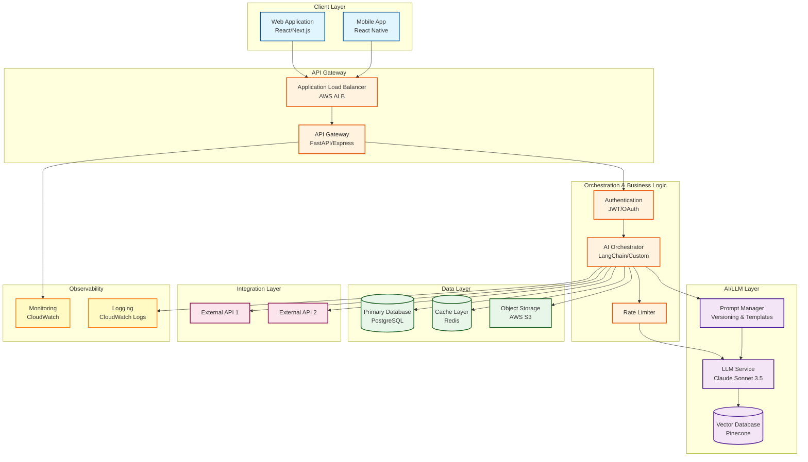
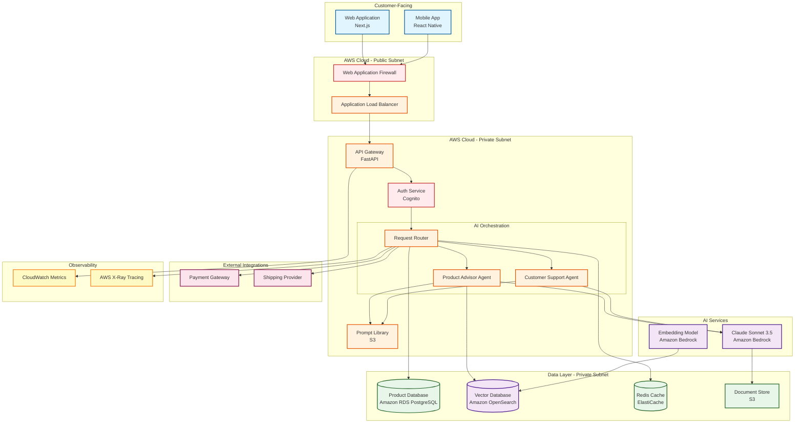

# Architecture Diagram Generation - User Prompt

**Phase:** Architecture Design (Step 2)  
**Purpose:** Generate visual AI system architecture diagrams for presentations, documentation, and stakeholder communication  
**Prerequisites:** Tech stack selection complete, requirements defined  
**Audience:** CTOs, VPs, technical leaders, junior AI engineers, executives

---

## Purpose

Generate high-level, presentation-ready architecture diagrams that effectively communicate your AI system design to both technical and non-technical stakeholders. The diagram should tell a compelling story about how your system works while being accurate, easy to understand, and aligned with AWS Well-Architected principles.

---

## Target Platform Selection

**First, select your target platform for diagram generation:**

### Option 1: ASCII Art / Plain Text
- **Best for:** Documentation, README files, terminal display, copy-paste anywhere
- **Pros:** Universal compatibility, no special tools required, version control friendly
- **Cons:** Limited visual sophistication
- **Example use case:** GitHub README, technical documentation

### Option 2: Lucidchart
- **Best for:** Professional presentations, collaborative editing, executive stakeholders
- **Pros:** Rich diagramming features, real-time collaboration, templates
- **Cons:** Requires Lucidchart account
- **URL:** https://www.lucidchart.com/pages
- **Import format:** Mermaid (Lucidchart supports Mermaid import)

### Option 3: Google Draw (Google Drawings)
- **Best for:** Quick diagrams, Google Workspace integration, easy sharing
- **Pros:** Free, collaborative, familiar interface
- **Cons:** Limited advanced features compared to dedicated tools
- **URL:** https://docs.google.com/drawings/
- **Import format:** Manual creation or Mermaid conversion

### Option 4: draw.io (diagrams.net)
- **Best for:** Technical diagrams, offline capability, AWS-specific icons
- **Pros:** Free, extensive shape libraries (including AWS icons), offline mode
- **Cons:** Steeper learning curve than Google Draw
- **URL:** https://www.drawio.com/
- **Import format:** Mermaid, XML

### Option 5: Mermaid Diagrams
- **Best for:** Markdown-based documentation, developer-friendly, version control
- **Pros:** Code-based (version controllable), renders in GitHub/GitLab, works across tools
- **Cons:** Less control over visual aesthetics
- **Format:** Markdown code blocks
- **Renders in:** GitHub, GitLab, VS Code, Notion, Obsidian

**Recommendation:** **Mermaid** is the most versatile choice—it works across multiple platforms (Lucidchart, draw.io, documentation) and is code-based for version control.

---

## Your Platform Choice

**Which platform will you use for your architecture diagram?**

[User responds with choice: ASCII / Lucidchart / Google Draw / draw.io / Mermaid]

---

## Input Requirements

To generate an accurate architecture diagram, I need:

### From Knowledge Base (Automatic)

**user_user_requirements.json:**
- Use case and functional requirements
- Integration needs (external systems, APIs)
- Performance targets (latency, throughput)
- Security and compliance requirements
- Scale expectations (users, data volume)

**design_design_decisions.json → tech_stack:**
- LLM providers and models
- Orchestration frameworks
- Backend/frontend technologies
- Infrastructure components (cloud, databases, caching)
- Integration approach

**system_config.json:**
- Platform constraints
- Deployment target (AWS, Azure, GCP, on-prem, hybrid)

### From You (User Input)

**Diagram Specifics:**
1. **Level of Detail:** How detailed should the diagram be?
   - High-level overview (major components only, 5-8 boxes)
   - Standard detail (components + key integrations, 10-15 boxes)
   - Detailed (all components + data flows, 15+ boxes)

2. **Focus Areas:** What should the diagram emphasize?
   - Overall system architecture
   - Security and compliance boundaries
   - Data flow and processing pipeline
   - Integration architecture
   - Deployment and infrastructure
   - All of the above (comprehensive)

3. **Target Audience:** Who will primarily view this diagram?
   - Technical team (engineers, architects)
   - Leadership (CTOs, VPs, directors)
   - Mixed audience (presentations to diverse stakeholders)
   - External (clients, partners, regulators)

---

## Diagram Generation Prompts

### For AI Architect Agent

Based on your selections, generate an architecture diagram with these specifications:

**Requirements:**
- **Clarity:** Readable by junior engineers without specialized knowledge
- **Simplicity:** High-level, not overly complex—focus on major components
- **Story:** The diagram should tell a story about how data flows and components interact
- **Accuracy:** Technically accurate representation of the tech stack
- **Validity:** Output must be valid and renderable on the chosen platform

**Well-Architected Visualization Requirements:**

Following AWS Well-Architected Framework, the diagram must show:

1. **Security Pillar:**
   - Clear security boundaries (VPCs, subnets, security groups)
   - Authentication and authorization points
   - Data encryption (at rest, in transit)
   - Compliance zones (if applicable: HIPAA, GDPR, etc.)

2. **Reliability Pillar:**
   - Fault-tolerant components (redundancy, failover)
   - Backup and disaster recovery points
   - Health checks and monitoring

3. **Performance Efficiency Pillar:**
   - Caching layers
   - Load balancers
   - Auto-scaling components
   - Database read replicas (if applicable)

4. **Cost Optimization Pillar:**
   - Right-sized component representations (don't over-architect)
   - Cost-effective service choices visible

5. **Operational Excellence Pillar:**
   - Monitoring and logging components
   - CI/CD pipeline (if relevant to architecture)
   - Observability stack

6. **Sustainability Pillar:**
   - Energy-efficient choices noted (serverless, managed services)

**GenAI-Specific Elements** (AWS GenAI Lens):

- **Foundation Models:** Show LLM providers (Claude, GPT-4, etc.) and model selection
- **Prompt Management:** Indicate prompt storage/versioning if applicable
- **RAG Architecture:** If using RAG (Retrieval Augmented Generation):
  - Document ingestion pipeline
  - Vector database
  - Embedding generation
  - Retrieval mechanism
- **AI Service Boundaries:** Clear delineation between AI components and traditional services
- **Model Monitoring:** LLM output monitoring and evaluation

---

## Output Specifications by Platform

### ASCII Art / Plain Text Format

**Structure:**

```
┌─────────────────────────────────────────────────────┐
│                  User Interface                      │
│         (Web App / Mobile App / API)                │
└────────────────┬────────────────────────────────────┘
                 │
                 │ HTTPS
                 ▼
┌─────────────────────────────────────────────────────┐
│              API Gateway / Load Balancer            │
│                   (AWS ALB / NGINX)                 │
└────────────┬──────────────────────────┬─────────────┘
             │                          │
             │                          │
             ▼                          ▼
┌─────────────────────┐      ┌──────────────────────┐
│  Orchestration      │      │   AI/LLM Services    │
│  Layer              │◄────►│   (Claude API)       │
│  (FastAPI/Express)  │      │                      │
└──────────┬──────────┘      └──────────────────────┘
           │
           │
           ▼
┌─────────────────────────────────────────────────────┐
│              Data Layer                             │
│  ┌──────────┐  ┌───────────┐  ┌─────────────┐     │
│  │PostgreSQL│  │Redis Cache│  │Vector DB    │     │
│  │          │  │           │  │(Pinecone)   │     │
│  └──────────┘  └───────────┘  └─────────────┘     │
└─────────────────────────────────────────────────────┘

Legend:
→  : Synchronous request/response
◄─►: Bidirectional communication
```

**Requirements:**
- Use box-drawing characters (┌─┐│└┘├┤┬┴┼) for clean structure
- Show clear data flow with arrows
- Include component names and technologies
- Add legend for symbols
- Keep width <80 characters for terminal compatibility

---

### Mermaid Diagram Format

**Structure:**



**Requirements:**
- Use `graph TD` (top-down) or `graph LR` (left-right) based on complexity
- Group related components in `subgraph` blocks
- Use descriptive node labels with technology names
- Apply color coding with `classDef` for visual clarity
- Show clear data flow directions with arrows
- Include security boundaries as subgraphs

**Validation:**
- Test in Mermaid Live Editor (https://mermaid.live) to ensure syntax is valid
- Ensure all nodes are properly connected
- Verify colors render correctly

---

### Lucidchart / draw.io / Google Draw Format

For these visual tools, provide **Mermaid code** (they support Mermaid import) OR **detailed component specifications**:

**Component Specifications:**

```markdown
## Component List

### User-Facing Layer
1. **Web Application**
   - Technology: React + Next.js
   - Hosting: Vercel / AWS Amplify
   - Icon: Browser/Desktop icon
   - Connections: → API Gateway

2. **Mobile Application**
   - Technology: React Native
   - Platform: iOS, Android
   - Icon: Mobile phone icon
   - Connections: → API Gateway

### API & Orchestration Layer
3. **API Gateway**
   - Technology: FastAPI (Python)
   - Hosting: AWS ECS Fargate
   - Icon: Server/Gateway icon
   - Connections: ← Web App, Mobile App | → Orchestrator

4. **AI Orchestrator**
   - Technology: LangChain
   - Purpose: Route requests to appropriate agents
   - Icon: Router/Hub icon
   - Connections: ← API Gateway | → LLM Service, Databases

[Continue for all components...]

## Data Flows

1. **User Query Flow:**
   User → API Gateway → Orchestrator → LLM Service → Vector DB (retrieve context) → LLM Service (generate response) → User

2. **Authentication Flow:**
   User → API Gateway → Auth Service → Database (verify) → Return Token

[Continue for all critical flows...]

## Security Boundaries

1. **Public Internet → AWS VPC:** API Gateway (public subnet)
2. **API Gateway → Backend Services:** Private subnet, security groups
3. **Backend → Databases:** Private subnet, no public access
4. **Backend → External APIs:** NAT Gateway for outbound

## Color Coding Scheme

- **Blue (#e1f5ff):** User-facing components
- **Orange (#fff3e0):** Backend/orchestration
- **Purple (#f3e5f5):** AI/LLM services
- **Green (#e8f5e9):** Data storage
- **Pink (#fce4ec):** External integrations
- **Yellow (#fff9c4):** Monitoring/observability
```

**Instructions for Manual Creation:**
1. Create shapes for each component (rounded rectangles for services, cylinders for databases)
2. Add component names and technology labels
3. Connect with arrows showing data flow direction
4. Group related components with containers/swimlanes
5. Apply color coding scheme
6. Add legend for symbols and colors

---

## Well-Architected Validation Checklist

Before finalizing the diagram, validate against AWS Well-Architected Framework:

### Security Checklist
- [ ] VPC boundaries clearly shown
- [ ] Public vs. private subnets indicated
- [ ] Security groups / firewalls represented
- [ ] Authentication mechanisms visible
- [ ] Encryption points marked (at rest, in transit)
- [ ] Compliance zones labeled (if applicable)

### Reliability Checklist
- [ ] Redundant components shown (multi-AZ, backups)
- [ ] Load balancers included
- [ ] Health checks indicated
- [ ] Failover paths visible
- [ ] Disaster recovery components present

### Performance Efficiency Checklist
- [ ] Caching layers included
- [ ] Auto-scaling components marked
- [ ] Content delivery (CDN) if applicable
- [ ] Database read replicas (if needed)
- [ ] Asynchronous processing (queues) shown

### Cost Optimization Checklist
- [ ] Right-sized components (not over-architected)
- [ ] Managed services preferred over self-managed
- [ ] Serverless options where appropriate
- [ ] No unnecessary redundancy

### Operational Excellence Checklist
- [ ] Monitoring components visible
- [ ] Logging infrastructure shown
- [ ] Deployment pipeline (if relevant)
- [ ] Observability stack included

### Sustainability Checklist
- [ ] Energy-efficient choices (serverless, managed services)
- [ ] No unnecessary over-provisioning

### GenAI Lens Checklist
- [ ] Foundation model provider clearly labeled
- [ ] Model selection rationale implicit in diagram
- [ ] RAG architecture components (if applicable):
  - [ ] Vector database
  - [ ] Document ingestion
  - [ ] Embedding generation
  - [ ] Retrieval mechanism
- [ ] Prompt management approach visible
- [ ] LLM monitoring/evaluation indicated
- [ ] Cost optimization (model caching, smaller models for simple tasks)

---

## Output Deliverable

Your final architecture diagram deliverable should include:

### 1. The Diagram Itself
[Generated in chosen format]

### 2. Diagram Description (Narrative)

```markdown
## Architecture Overview

**Summary:** [1-2 sentence high-level description]

**Key Components:**

1. **[Component Name]:**
   - Purpose: [What it does]
   - Technology: [Specific tech choice]
   - Rationale: [Why this choice aligns with Well-Architected]

2. **[Component Name]:**
   [Same structure...]

**Data Flows:**

1. **[Flow Name]:** [Step-by-step description of how data moves through the system]

2. **[Flow Name]:** [Same structure...]

**Well-Architected Alignment:**

- **Security:** [How the architecture addresses security pillar]
- **Reliability:** [How the architecture addresses reliability pillar]
- **Performance:** [How the architecture addresses performance pillar]
- **Cost:** [How the architecture optimizes costs]
- **Operations:** [How the architecture supports operational excellence]
- **Sustainability:** [How the architecture minimizes environmental impact]

**GenAI-Specific Considerations:**

- **Model Selection:** [Why specific LLM chosen]
- **RAG Approach:** [If applicable, how RAG is implemented]
- **Prompt Management:** [How prompts are versioned and managed]
- **Cost Optimization:** [How LLM API costs are optimized]

**Deployment Considerations:**

- **Cloud Platform:** [AWS / Azure / GCP / Multi-cloud]
- **Region:** [Specific region and rationale]
- **Scalability:** [How system scales with demand]
- **Disaster Recovery:** [Backup and failover strategy]
```

### 3. Presentation Notes

**For Technical Audiences (Junior Engineers):**
- Focus on: Component interactions, data flows, technology choices
- Emphasize: Implementation details, why specific technologies chosen
- Talking points: [3-5 key technical points]

**For Business Audiences (CTOs, Executives):**
- Focus on: Business value, cost efficiency, scalability, risk mitigation
- Emphasize: ROI, competitive advantages, compliance, reliability
- Talking points: [3-5 key business points]

### 4. Diagram Validation

**Technical Validation:**
- [ ] All components from tech stack are represented
- [ ] Data flows are logically correct
- [ ] No missing critical components
- [ ] Integrations accurately depicted

**Audience Validation:**
- [ ] Readable by junior engineers (not overly complex)
- [ ] Digestible by executives (tells a clear story)
- [ ] No jargon without explanation
- [ ] Visually clean and professional

**Platform Validation:**
- [ ] Renders correctly on chosen platform
- [ ] Valid syntax (for Mermaid/code-based)
- [ ] No broken references or missing shapes
- [ ] Colors display as intended

---

## Example: E-Commerce AI Assistant Architecture (Mermaid)



**Narrative:**

This e-commerce AI assistant architecture demonstrates a well-architected GenAI system with clear separation of concerns. Customer requests flow through WAF and ALB for security, then route to specialized AI agents (Product Advisor, Customer Support) via an intelligent router. The system leverages Amazon Bedrock for Claude Sonnet 3.5, with prompts stored in S3 for version control. Vector database enables semantic product search. The architecture emphasizes security (WAF, private subnets), reliability (load balancing, caching), and observability (CloudWatch, X-Ray).

---

## Common Diagram Patterns for GenAI Systems

### Pattern 1: Simple LLM API Wrapper
```
User → API Gateway → LLM Service → User
```
Use when: Basic chatbot, no complex logic

### Pattern 2: RAG (Retrieval Augmented Generation)
```
User → API → Orchestrator → {Vector DB (retrieve), LLM (generate)} → User
```
Use when: Need to augment LLM with proprietary data

### Pattern 3: Multi-Agent System
```
User → Router → {Agent 1, Agent 2, Agent N} → Aggregator → User
```
Use when: Complex workflows requiring specialized agents

### Pattern 4: Agentic Workflow (Tool Use)
```
User → Orchestrator → {LLM decides} → {Tool 1, Tool 2, ...Tool N} → Orchestrator → User
```
Use when: LLM needs to call external tools/APIs dynamically

### Pattern 5: Conversational AI with Memory
```
User → API → {Session Manager, LLM, Conversation History DB} → User
```
Use when: Multi-turn conversations requiring context

---

## Success Criteria

Your architecture diagram is successful when:

✅ **Technical Accuracy**
- All components from tech stack are represented
- Data flows are correct and complete
- No missing critical components

✅ **Audience Appropriateness**
- Junior engineers can understand component interactions
- Executives can grasp the high-level system story
- No unnecessary complexity

✅ **Well-Architected Compliance**
- All 6 pillars visibly addressed
- GenAI Lens principles reflected
- Security boundaries clear

✅ **Visual Quality**
- Clean, professional appearance
- Logical layout (left-to-right or top-to-bottom flow)
- Consistent styling and color scheme
- Readable labels and annotations

✅ **Platform Validity**
- Renders correctly on chosen platform
- Syntax is valid (for code-based diagrams)
- No errors or warnings

✅ **Presentation Ready**
- Can be used in executive presentations
- Tells a compelling story about the system
- Includes narrative description
- Has talking points for different audiences

---

## Knowledge Base Update

After generating the diagram, update the knowledge base:

**Write to:** `knowledge_base/design_design_decisions.json` → `architecture_design` section

```json
{
  "architecture_design": {
    "diagram_format": "[ASCII / Mermaid / Lucidchart / draw.io / Google Draw]",
    "diagram_code": "[Full diagram code/specification]",
    "diagram_description": "[Narrative description]",
    "key_components": [
      {"name": "Component1", "technology": "Tech", "purpose": "Description"},
      {"name": "Component2", "technology": "Tech", "purpose": "Description"}
    ],
    "data_flows": [
      {"name": "Flow1", "path": "A → B → C", "description": "Purpose"}
    ],
    "well_architected_alignment": {
      "security": "Description",
      "reliability": "Description",
      "performance": "Description",
      "cost": "Description",
      "operations": "Description",
      "sustainability": "Description"
    },
    "genai_considerations": {
      "model_selection_rationale": "Why this LLM",
      "rag_approach": "RAG implementation details (if applicable)",
      "prompt_management": "How prompts are managed",
      "cost_optimization": "LLM cost strategies"
    },
    "presentation_notes": {
      "technical_talking_points": ["Point 1", "Point 2", "Point 3"],
      "business_talking_points": ["Point 1", "Point 2", "Point 3"]
    },
    "created_date": "2025-10-03",
    "last_updated": "2025-10-03"
  }
}
```

---

This prompt ensures your architecture diagram effectively communicates your AI system design to all stakeholders while maintaining technical accuracy and alignment with AWS Well-Architected principles.


