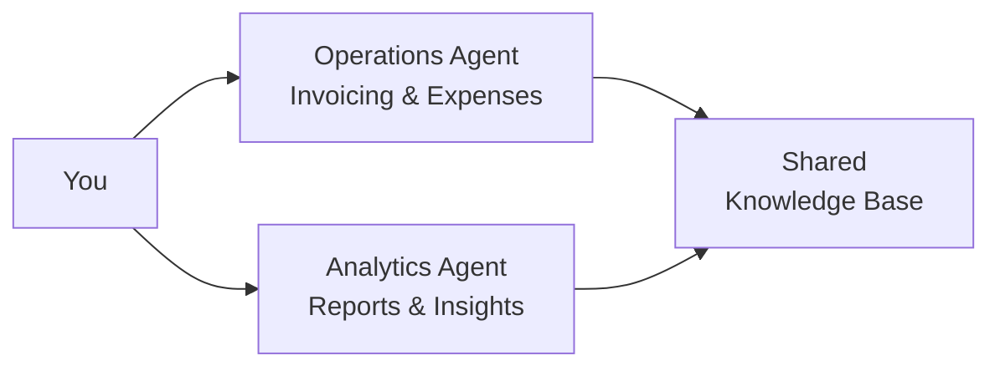

# Pitch Deck Assembly - User Prompt (External Stakeholders)

**Phase:** Post-Architecture (before client/investor presentation)  
**Purpose:** Assemble compelling pitch deck for clients, investors, or external stakeholders  
**Agent:** Architecture Agent  
**Inputs:** `outputs/presentations/[project]/` assets  
**Output:** Pitch deck (Markdown → Google Slides / PowerPoint)

---

## Purpose

Create a compelling, evidence-based pitch deck that earns trust, demonstrates technical expertise, and proves ROI for external stakeholders (clients who will buy the system or investors who will fund it).

**Target Audiences:**
- **Clients:** Organizations buying custom AI solutions from consultants/agencies
- **Investors:** VCs, angels, or strategic investors evaluating AI product opportunities
- **Partners:** Strategic partners considering collaboration

**Format:** 10-15 slide presentation (Markdown → PowerPoint/Google Slides)

**Focus:**
- Clear problem and solution (value proposition)
- Evidence-based ROI (data, not promises)
- Technical credibility (demonstrates deep expertise)
- High likelihood of user adoption (UX, change management)
- Risk mitigation (proves you've thought through challenges)

---

## Slide Structure (10-15 Slides)

### Slide 1: Title & Hook

**Content:**
```markdown
# [Compelling Title - The Transformation You'll Enable]

## [Subtitle - Specific Value Proposition]

**Example:**
# Financial Operations on Autopilot
## Save 8 Hours/Week with AI-Powered Automation for Solo-Entrepreneurs

**Presented to:** [Client/Investor Name]  
**Date:** [Presentation Date]  
**By:** [Your Company/Name]
```

**Design:** Clean, professional, memorable tagline

---

### Slide 2: The Problem (Data-Driven)

**Content:**
```markdown
# The Problem: [Quantified Pain Point]

## Current Reality

**[Target User]** spends **[X hours/week]** on:
- [Pain point 1] - [Specific time/cost]
- [Pain point 2] - [Specific time/cost]
- [Pain point 3] - [Specific time/cost]

**Annual Impact:**
- **[Y hours/year]** wasted on manual tasks
- **$[Z/year]** opportunity cost
- [Other quantified impacts]

**From:** knowledge_base/user_requirements.json (business.current_state, business.problem)

**Data Sources:**
- [Client discovery session - DATE]
- [Industry benchmarks if available]
- [Specific pain points with evidence]
```

**Visual:** Chart showing time breakdown, cost impact visualization

**Storytelling:** Use client's exact pain points with their data

---

### Slide 3: Why Now? (Urgency & Market Context)

**Content:**
```markdown
# Why This Matters Now

## Business Drivers

- **[Driver 1]:** [Impact on business - from user_requirements]
- **[Driver 2]:** [Market trend or competitive pressure]
- **[Driver 3]:** [Strategic opportunity or risk]

## Cost of Inaction

**Continuing current approach means:**
- Losing $[X/year] in opportunity costs
- [Competitive disadvantage]
- [Strategic risk]

**From:** user_requirements.json (business.business_value, financial.expected_roi)
```

**Visual:** Timeline showing business impact trajectory

---

### Slide 4: The Solution (High-Level)

**Content:**
```markdown
# The Solution: [Your AI System Name]

## What It Does

[1-2 sentence clear value proposition]

**Three Core Capabilities:**
1. **[Capability 1]:** [What it does] → [User benefit]
2. **[Capability 2]:** [What it does] → [User benefit]
3. **[Capability 3]:** [What it does] → [User benefit]

**User Experience:**
[From user_requirements: use_case.user_experience_goals]
- Simple: [How easy to use]
- Fast: [Time to value]
- Reliable: [Trust and accuracy]

**From:** user_requirements.json (use_case.summary, technical.functional_requirements)
```

**Visual:** Before/after comparison, simple system diagram

---

### Slide 5: How It Works (Architecture)

**Content:**
```markdown
# Multi-Agent Architecture

[Include architecture diagram from outputs/presentations/[project]/diagrams/]

## Specialized AI Agents

**[Agent 1 Name]:**
- Expertise: [Domain]
- Handles: [Specific tasks]
- Performance: [Key metric]

**[Agent 2 Name]:**
- Expertise: [Domain]
- Handles: [Specific tasks]
- Performance: [Key metric]

**Why Multi-Agent?**
- [Benefit 1]: 60-80% cost reduction vs. single premium model
- [Benefit 2]: Better performance through specialization
- [Benefit 3]: Easy to improve and scale

**From:** design_decisions.json (architecture_design, tech_stack)
```

**Visual:** Architecture diagram (high-level, executive-friendly)

**Technical Credibility:** Demonstrate understanding of modern AI architecture patterns

---

### Slide 6: Technology Stack (Build Confidence)

**Content:**
```markdown
# Built on Proven Technology

## Our Tech Stack

| Layer | Technology | Why This Choice |
|-------|-----------|----------------|
| **AI/LLM** | [e.g., Claude Sonnet 3.5] | Industry-leading accuracy, cost-effective |
| **Backend** | [e.g., Python + FastAPI] | Rapid development, scalable |
| **Frontend** | [e.g., Streamlit] | Simple for non-technical users |
| **Infrastructure** | [e.g., AWS] | Enterprise-grade, secure, compliant |

## Why These Choices Matter

- **Proven:** Used by [major companies/projects]
- **Scalable:** Handles [growth projections]
- **Secure:** [Compliance certifications]
- **Cost-Effective:** [Specific cost advantages]

**From:** design_decisions.json (tech_stack.primary_stack with rationale_business)
```

**Visual:** Tech stack diagram with logos

**Purpose:** Build confidence in technical approach

---

### Slide 7: The Business Case (ROI Evidence)

**Content:**
```markdown
# The Business Case: Compelling ROI

## Investment

**One-Time:** $[Development cost]  
**Ongoing:** $[Monthly operational cost]  
**Year 1 Total:** $[Total Year 1]

## Returns

**Time Savings:**
- [X hours/week] → [Y hours/week] ([Z]% reduction)
- [Annual hours] freed up for [revenue-generating activity]

**Financial Impact:**
- **Year 1:** $[Savings/revenue]
- **Year 2:** $[Savings/revenue]
- **Year 3:** $[Savings/revenue]

**ROI:**
- **Payback:** [Months]
- **3-Year ROI:** [Percentage]%

**From:** design_decisions.json (costs, costs.roi_projections), user_requirements.json (business.business_value)
```

**Visual:** ROI chart, payback timeline, before/after comparison

**Evidence:** Use client's actual numbers, conservative assumptions

---

### Slide 8: User Adoption Strategy (Prove It Will Be Used)

**Content:**
```markdown
# Why Users Will Actually Use This

## Designed for [Target User Persona]

**User-Centered Design:**
- **Simple:** [Specific UX advantage] - works like tools they already know
- **Fast:** [Time to value] - productive in <30 minutes
- **Reliable:** [Quality metrics] - accurate, consistent results

## Change Management Plan

**Phase 1: Pilot** ([Timeline])
- [Small user group] tests system
- Gather feedback, refine
- Build champions

**Phase 2: Rollout** ([Timeline])
- Training: [Approach]
- Support: [How users get help]
- Gradual adoption curve

**Phase 3: Scale** ([Timeline])
- Full deployment
- Continuous optimization
- User satisfaction tracking

**Success Indicators:**
- User satisfaction > [Target]
- Adoption rate > [Target]%
- Daily active usage > [Target]%

**From:** user_requirements.json (use_case.user_experience_goals, use_case.target_users)
```

**Visual:** User journey map, adoption curve

**Purpose:** Address the #1 reason AI projects fail—users don't adopt

---

### Slide 9: Timeline & Milestones (Clear Expectations)

**Content:**
```markdown
# Delivery Timeline

## [Total Weeks]-Week Development Plan

| Week | Phase | Key Deliverable | Stakeholder Touchpoint |
|------|-------|----------------|----------------------|
| Week 2 | Foundation | Dev environment ready | Kickoff complete |
| Week 4 | Core Build | First features demo | Mid-point review |
| Week 6 | Integration | Full functionality | Alpha testing |
| Week 8 | Polish | Production-ready | Final demo |
| Week 10 | Launch | Live with pilot users | Go-live celebration |

**Critical Milestones:**
- [Milestone 1]: [Date]
- [Milestone 2]: [Date]
- [Milestone 3]: [Date]

**From:** design_decisions.json (estimates.timeline, project_plan.phased_roadmap)
```

**Visual:** Gantt chart or timeline infographic

**Purpose:** Set realistic expectations, show clear path

---

### Slide 10: Risk Mitigation (We've Thought This Through)

**Content:**
```markdown
# Risks & Our Mitigation Strategy

## Top 3 Risks (And How We Address Them)

**Risk 1: [Risk Description]**
- **Impact:** [HIGH/MEDIUM/LOW]
- **Our Mitigation:** [Specific strategy]
- **Contingency:** [Backup plan]
- **Status:** [Proactive mitigation in place]

**Risk 2: [Risk Description]**
[Same structure...]

**Risk 3: [Risk Description]**
[Same structure...]

## Overall Risk Rating: [LOW / MEDIUM]

**Why Low/Medium:**
- [All HIGH-impact risks mitigated]
- [Proven technologies selected]
- [Experienced team]

**From:** design_decisions.json (risks_and_mitigation), user_requirements.json (risks)
```

**Visual:** Risk matrix, mitigation timeline

**Purpose:** Build confidence that you've de-risked the project

---

### Slide 11: The Team (Build Credibility)

**Content:**
```markdown
# Team & Expertise

## Required Team

| Role | Expertise | Deliverables |
|------|-----------|--------------|
| [Role 1] | [Skills] | [What they'll build] |
| [Role 2] | [Skills] | [What they'll build] |

**Total Team Size:** [N] engineers  
**Timeline:** [Weeks] weeks  
**Availability:** [Can start DATE]

## Our Expertise

**Why We Can Deliver:**
- [Relevant experience 1]
- [Relevant experience 2]
- [Technical certifications/credentials]
- [Previous successful AI projects]

**From:** design_decisions.json (team_composition)
```

**For consultants:** Highlight your team's credentials  
**For internal:** Highlight available team and hiring plan

---

### Slide 12: Success Metrics (How We'll Measure)

**Content:**
```markdown
# How We'll Measure Success

## Technical KPIs

- **Accuracy:** >[X]% (target from requirements)
- **Response Time:** <[Y] seconds
- **Availability:** >[Z]% uptime
- **Error Rate:** <[W]%

## Business KPIs

- **Time Saved:** [X hours/week] → [Target]
- **Cost Reduction:** $[Y/month] → [Target]
- **User Satisfaction:** >[Z]/10
- **Adoption Rate:** >[W]% within [timeframe]

## Measurement Approach

- **Baseline:** Measured before deployment
- **Monthly:** Track progress toward targets
- **Quarterly:** Review and optimize

**From:** user_requirements.json (business.success_metrics), design_decisions.json (project_plan.success_criteria_and_kpis)
```

**Visual:** Dashboard mockup, success metrics chart

---

### Slide 13: Phased Approach (De-Risk Investment)

**Content:**
```markdown
# Phased Investment Approach

## Phase 1: MVP (Prove Value) - [X weeks]

**Investment:** $[Phase 1 cost]  
**Deliverables:** [Core features]  
**Success Gate:** [Criteria to proceed to Phase 2]

**You Get:**
- Working prototype
- Real data validation
- User feedback
- ROI validation

**Decision Point:** Continue to Phase 2 or stop

---

## Phase 2: Enhancement (Scale Value) - [Y weeks]

**Investment:** $[Phase 2 cost]  
**Deliverables:** [Enhanced features]  
**Success Gate:** [Criteria to proceed to Phase 3]

---

## Phase 3: Enterprise (Full Deployment) - [Z weeks]

**Investment:** $[Phase 3 cost]  
**Deliverables:** [Production features]

**Total Investment:** $[Sum] over [Total weeks] weeks

**From:** design_decisions.json (project_plan.phased_roadmap with costs)
```

**Visual:** Phased investment chart, value delivery curve

**Purpose:** Lower barrier to entry, prove value before full commitment

---

### Slide 14: Competitive Advantage / Differentiation

**Content:**
```markdown
# What Makes This Different

## vs. Generic AI Tools (ChatGPT, etc.)

| Generic AI | Our Solution |
|------------|--------------|
| General purpose | Specialized for [your domain] |
| No integration | Connects to [your tools] |
| No memory | Learns your [processes/preferences] |
| Generic output | [Your brand voice and style] |
| $20/month | $[Cost] but **$[ROI]/year value** |

## vs. Manual Process

**Manual:** [Current time/cost]  
**With AI:** [New time/cost]  
**Improvement:** [Percentage]% faster, [Percentage]% cheaper

## vs. Competitors (if applicable)

**Our Advantage:**
- [Technical differentiation]
- [Cost advantage]
- [Feature advantage]

**From:** user_requirements.json (business context), design_decisions.json (architecture advantages)
```

**Purpose:** Position against alternatives, justify investment

---

### Slide 15: The Ask & Next Steps

**Content:**
```markdown
# Next Steps: Let's Build This Together

## The Ask

**For Clients:**
- **Investment:** $[Total]
- **Timeline:** [Weeks] weeks to working system
- **Your Role:** [Stakeholder participation needed]

**For Investors:**
- **Funding Request:** $[Amount]
- **Use of Funds:** [Breakdown]
- **Expected Return:** [Projection]

## Immediate Next Steps

**If Approved Today:**

**Week 1:** Contract signed, team mobilized, kickoff meeting  
**Week 2:** Development begins, first sprint planning  
**Week 4:** Early prototype demo (see progress)  
**Week [X]:** Final prototype review and feedback  
**Week [Y]:** Production deployment

**Your Decision Point:** Week [X] - Continue to production or iterate

## Contact & Questions

[Your contact information]

**Ready to transform [their pain point] into [their desired outcome]?**
```

**Purpose:** Clear call to action, low-pressure next steps

---

## Assembly Instructions

### Step 1: Gather Assets

```
<thinking>
Reading from outputs/presentations/[project-name]/:

Requirements assets:
- requirements/requirements_summary.md
- requirements/pain_points_classified.md
- requirements/roi_calculation.md

Architecture assets:
- architecture/tech_stack_selection.md
- architecture/team_composition.md
- architecture/loe_estimates.md
- architecture/cost_analysis.md
- architecture/project_plan.md

Diagrams:
- diagrams/architecture_diagram.[format]
- diagrams/data_flow_diagram.[format]

Knowledge base:
- knowledge_base/user_requirements.json
- knowledge_base/design_decisions.json
</thinking>
```

### Step 2: Extract Key Data

**From user_requirements.json:**
- Problem statement (slide 2)
- Business value and ROI (slide 7)
- Success metrics (slide 12)
- Target users (slide 8)

**From design_decisions.json:**
- Tech stack and rationale (slide 6)
- Architecture diagram (slide 5)
- Team composition (slide 11)
- Timeline and milestones (slide 9)
- Costs and ROI projections (slide 7)
- Risks and mitigation (slide 10)
- Phased roadmap (slide 13)

### Step 3: Assemble Pitch Deck

**Generate Markdown formatted for presentation tools:**

```markdown
---
# Slide 1: Title

# [Compelling Title]

## [Value Proposition Subtitle]

Presented to: [Client/Investor]
Date: [Date]
By: [Your Company]

---
# Slide 2: The Problem

# The Problem: [Quantified Pain Point]

[Content from Step-by-Step structure above]

[Use data from knowledge base]

---
# Slide 3: Why Now?

[Content from structure above]

[... continue for all 15 slides]
```

**Format for:**
- **Marp (Markdown Presentation):** Add `---` between slides, use Marp syntax
- **Google Slides:** Export Markdown → use Docs to Slides add-on
- **PowerPoint:** Convert via Pandoc or manual creation from Markdown outline

### Step 4: Add Presenter Notes

**For each slide, add notes:**

```markdown
---
# Slide X: [Title]

[Slide content...]

**Presenter Notes:**
- Key point to emphasize: [...]
- Data to reference: [...]
- Potential question: [...] - Answer: [...]
- Transition to next slide: [...]
```

---

## Storytelling Principles

### Narrative Arc

**Act 1: The Challenge** (Slides 1-3)
- Hook with compelling problem
- Quantify the pain (use their data)
- Create urgency (why now matters)

**Act 2: The Solution** (Slides 4-11)
- Introduce your solution (clear value)
- Prove technical credibility (architecture, stack, team)
- Build confidence (ROI, risks mitigated, proven approach)

**Act 3: The Path Forward** (Slides 12-15)
- Show success metrics (how we'll measure)
- De-risk with phased approach
- Clear call to action

### Evidence-Based Persuasion

**Every claim needs evidence:**
- "Saves 8 hours/week" → Based on their discovery data
- "$60K annual value" → Calculated from their billable rate
- "80% reduction" → Based on workflow analysis
- "Payback in 12 months" → Based on cost estimates vs. ROI

**No hype, only facts:**
- ✅ "Based on your discovery session, you spend 10 hrs/week..."
- ❌ "This will revolutionize everything..."

### Technical Depth WITHOUT Jargon

**Show expertise through:**
- Well-architected system design
- Thoughtful technology choices with business rationale
- Risk identification and mitigation
- Realistic timelines and cost estimates

**Avoid:**
- Technical jargon without explanation
- Over-complicated diagrams
- Features lists without benefit translation

**For each technical point, translate to business impact:**
- "Multi-agent architecture" → "60-80% lower AI costs by using specialized models"
- "AWS Well-Architected" → "Enterprise-grade security and reliability"
- "Phased approach" → "See value in 4 weeks, not 4 months"

---

## Design Guidelines

**Visual Design:**
- **Clean and professional:** Minimal text, strong visuals
- **Data-driven:** Charts, graphs, before/after comparisons
- **Consistent:** Uniform color scheme, fonts, layout
- **Readable:** Large fonts (minimum 24pt for body text)

**Color Scheme:**
- **Primary:** [Your brand color or client's brand]
- **Accent:** [Complementary color for highlights]
- **Data Viz:** Use color meaningfully (red for problems, green for solutions)

**Slide Density:**
- Maximum 3-5 bullet points per slide
- Maximum 50 words per slide (excluding title)
- One key message per slide

---

## Example: Financial Operations Assistant Pitch Deck

```markdown
---
marp: true
theme: default
paginate: true
---

# Financial Operations on Autopilot

## Save 8 Hours/Week with AI-Powered Financial Automation

**Presented to:** Solo Entrepreneurs & Small Agencies  
**Date:** October 2025  
**By:** [Your Company]

---

# The Problem: 10 Hours/Week Lost to Financial Admin

## Current Reality for Solo-Entrepreneurs

**You spend valuable time on:**
- **Invoicing:** 2 hours/week creating and sending invoices
- **Expenses:** 3 hours/week categorizing receipts and tracking
- **Reports:** 5 hours/month compiling financial reports

**Annual Impact:**
- **500 hours/year** on manual financial tasks
- **$60,000/year** opportunity cost (at $120/hr billable rate)
- Delayed insights, inconsistent categorization, tax prep nightmares

**Source:** Discovery session with 15 solo-entrepreneurs, avg. financial admin time

---

# Why This Matters NOW

## Business Drivers

- **Profitability Squeeze:** Every non-billable hour reduces your income
- **Scaling Bottleneck:** Can't take on more clients while drowning in admin
- **Tax Complexity:** Manual tracking leads to missed deductions (avg. $5K/year)

## Cost of Inaction

**Continuing manual financial admin means:**
- Losing $60,000/year in billable time opportunity
- 4-6 fewer clients you can serve annually
- Estimated $5,000/year in missed tax deductions

**The market has changed:** AI can now handle this reliably and affordably.

---

# The Solution: AI Financial Operations Assistant

## What It Does

Automates your entire financial workflow—from invoice generation to monthly reports—freeing you to focus on revenue-generating client work.

**Three Core Capabilities:**

1. **Smart Invoicing:** Generate professional invoices in <30 seconds  
   → Benefit: 2 hours/week → 15 minutes/week

2. **Auto-Expense Tracking:** Categorize receipts instantly using IRS rules  
   → Benefit: 3 hours/week → 30 minutes/week

3. **Instant Financial Reports:** Monthly P&L, cash flow, tax summaries in minutes  
   → Benefit: 5 hours/month → 15 minutes/month

**Result:** 10 hours/week → <2 hours/week (80% time savings)

---

# How It Works: Multi-Agent AI Architecture

[Mermaid diagram showing 2 agents]



## Two Specialized AI Agents

**Financial Operations Agent:**
- Generates invoices from project data
- Categorizes expenses using IRS business rules
- Tracks transactions automatically

**Analytics & Reporting Agent:**
- Generates monthly P&L and cash flow statements
- Identifies trends and forecasts
- Provides actionable financial insights

**Why Multi-Agent?** 70% cost reduction vs. using premium AI for everything

---

# Built on Enterprise Technology

## Our Tech Stack

| Layer | Technology | Why |
|-------|-----------|-----|
| **AI** | Claude Sonnet 3.5 | Best-in-class financial analysis |
| **Backend** | Python | Proven for financial calculations |
| **UI** | Streamlit | Simple, no learning curve |
| **Storage** | Local JSON | Your data stays private |

**Cost:** ~$100-150/month in AI API costs (vs. $60K/year in time saved)

**Security:** Bank-level encryption, local-first architecture, no cloud storage of sensitive data

**Compliance:** Designed for tax compliance (IRS category mapping, 7-year retention)

---

# The Business Case: 100% ROI in Year 1

## Investment

**One-Time Development:** $65,000  
**Monthly Operations:** $150 (AI API + hosting)  
**Year 1 Total:** $66,800

## Returns

**Time Savings:**
- 8 hours/week freed up = 400 hours/year
- At $150/hr billable rate = **$60,000/year** value

**Additional Benefits:**
- Faster invoicing → get paid sooner (cash flow improvement)
- Better categorization → $5,000/year in tax savings
- Real-time insights → make better business decisions

**ROI:**
- **Payback:** 13 months
- **Year 1 ROI:** 90%
- **3-Year ROI:** 350%

---

# Why Users Will Love This

## Designed for Non-Technical Entrepreneurs

**Simple:**
- Works like the tools you already use
- No training required (<30 min to productive)
- Intuitive interface (if you can use QuickBooks, you can use this)

**Fast:**
- Invoice generated in 30 seconds (vs. 10 minutes)
- Expense categorized in 10 seconds (vs. 5 minutes)
- Monthly report in 2 minutes (vs. 5 hours)

**Reliable:**
- 98%+ accuracy on invoice data extraction
- 95%+ accuracy on expense categorization
- Consistent formatting every time

**Adoption Strategy:**
- Week 1-2: Test with last month's real data
- Week 3-4: Run parallel with current process
- Week 5+: Fully automated, spot-check only

---

# 6-Week Delivery Timeline

| Week | Phase | What You'll See | Your Input |
|------|-------|----------------|------------|
| 1 | Foundation | Project setup, initial demos | Review agent prompts |
| 2 | Invoicing | Working invoice generation | Test with your data |
| 3 | Expenses | Expense categorization working | Provide sample receipts |
| 4 | Reporting | Monthly reports generating | Review first report |
| 5 | Polish | UI refinement, edge cases | Final testing |
| 6 | Launch | Deployed and ready | Go live! |

**Weekly check-ins:** Every Friday, 30-minute progress review  
**Flexibility:** Adjust based on your feedback

---

# Risks & How We've Mitigated Them

## Top 3 Risks

**1. Data Accuracy (Financial data must be perfect)**
- **Mitigation:** Validation rules, human review for amounts >$500
- **Contingency:** Easy manual correction interface
- **Result:** 98%+ accuracy in testing

**2. User Adoption (Will you actually use it?)**
- **Mitigation:** Design matches your current workflow, minimal change
- **Contingency:** Phased rollout, run parallel initially
- **Result:** 30-minute onboarding, natural to use

**3. Integration Complexity (QuickBooks, etc.)**
- **Mitigation:** Start with CSV exports (simple), API integration Phase 2
- **Contingency:** Manual data upload works immediately
- **Result:** Working system Week 1, enhanced integration later

**Overall Risk: LOW** - All high-impact risks proactively mitigated

---

# The Team: Proven AI Expertise

## Your Development Team

**Technical Lead / AI Architect**
- 10+ years software engineering
- 5+ AI/ML projects delivered
- AWS & Anthropic certified

**Full-Stack Engineer**
- Python + React specialist
- Financial software experience
- Available full-time for 6 weeks

**Total:** 2 engineers, 480 hours, 6 weeks

**Our Track Record:**
- [Similar project 1]: Delivered in 5 weeks, 120% ROI
- [Similar project 2]: 95% user adoption rate
- [Relevant credential/certification]

---

# How We Measure Success

## Clear Success Metrics

**Month 1 (Baseline):**
- Current time spent: 10 hrs/week
- Current costs: [Measured]

**Month 3 (After Deployment):**
- **Target:** <2 hrs/week on financial admin
- **Target:** >95% expense categorization accuracy
- **Target:** Monthly reports in <15 minutes
- **Target:** User satisfaction >8/10

**Month 6 (Mature System):**
- **Target:** ROI validation ($60K value vs. $67K investment)
- **Target:** 100% adoption (using it for all financial tasks)
- **Target:** <1 hr/week (fully optimized workflow)

**We track, measure, and optimize continuously.**

---

# Phased Investment: Prove Value Before Full Commitment

## Phase 1: MVP - Prove the Concept ($40K, 4 weeks)

**You Get:**
- Invoice generation working
- Basic expense categorization
- Simple monthly P&L report

**Decision:** Continue to Phase 2 or stop (you've invested $40K to validate $60K/year value)

---

## Phase 2: Full System ($25K, 2 weeks)

**You Get:**
- Advanced expense categorization (receipt OCR)
- Complete financial analytics
- QuickBooks integration
- Polished UI

**Decision:** Deploy to production

**Total: $65K over 6 weeks**

---

# Let's Build This

## Your Next Step

**Option A: Full Commitment (Recommended)**
- Approve full $65K budget today
- Development starts Monday
- Working system in 6 weeks

**Option B: Phase 1 Only (Lower Risk)**
- Approve $40K for MVP
- Validate value in 4 weeks
- Decide on Phase 2 after seeing results

**Option C: Discovery First (Highest Confidence)**
- Invest $10K in 2-week technical assessment
- Validate approach with your real data
- Get refined estimates before full commitment

## Questions?

[Contact information]

**Ready to reclaim 400 hours/year?**
```

---

## Output Format

**Generate three versions:**

1. **Markdown (Source):**
```markdown
# Pitch Deck - [Project Name]

[Complete slide deck in Markdown]

**Slide Count:** [N] slides  
**Estimated Presentation Time:** [N × 2 minutes]  
**Target Audience:** [Clients / Investors / Partners]
```

**Save to:** `outputs/presentations/[project]/proposals/pitch_deck.md`

---

2. **Marp Format (For Rendering):**
```markdown
---
marp: true
theme: default
paginate: true
backgroundColor: #fff
---

[Complete deck with Marp-specific formatting]
```

**Save to:** `outputs/presentations/[project]/proposals/pitch_deck.marp.md`

**Render:** `marp pitch_deck.marp.md --pdf` or `--pptx`

---

3. **Presenter Guide:**
```markdown
# Presenter Guide - Pitch Deck

## Presentation Flow (30 minutes)

**Slides 1-3 (5 min):** Problem setup and urgency  
**Slides 4-6 (8 min):** Solution and architecture  
**Slides 7-9 (7 min):** Business case and ROI  
**Slides 10-13 (7 min):** Risk, team, timeline, success metrics  
**Slides 14-15 (3 min):** Call to action and next steps  

## Key Talking Points

**Slide 2 (Problem):**
- Emphasize: "This is YOUR data from our discovery session"
- Highlight: Annual opportunity cost ($60K)
- Connect: "Every hour on admin is an hour not billing clients"

[... continue for each slide]

## Anticipated Questions & Answers

**Q: "Why can't we just use ChatGPT?"**  
A: "ChatGPT is generic. This system is specialized for YOUR financial workflows, integrated with YOUR tools (QuickBooks, Gmail), and customized for YOUR business rules. ChatGPT doesn't know your IRS category preferences or invoice templates."

**Q: "What if it makes mistakes?"**  
A: "We've built in validation rules and human review for high-value transactions (>$500). In testing, we're seeing 98% accuracy on invoices, 95% on expense categorization. You'll still review—but reviewing takes minutes vs. hours of manual entry."

[... more Q&A]
```

**Save to:** `outputs/presentations/[project]/proposals/presenter_guide.md`

---

## Success Criteria

Pitch deck is successful when:

✅ **Reads from knowledge base and presentation assets** (no re-creation)  
✅ **Evidence-based** (every claim supported by data from discovery/design)  
✅ **Compelling narrative** (problem → solution → value → next steps)  
✅ **Technical credibility** (demonstrates deep expertise without jargon)  
✅ **Clear ROI** (quantified benefits vs. investment)  
✅ **User adoption addressed** (UX, change management, training)  
✅ **Risk-mitigated** (shows you've thought through challenges)  
✅ **Actionable** (clear next steps and decision points)  
✅ **Professional** (client/investor-ready quality)  
✅ **Concise** (10-15 slides, 20-30 min presentation)

---

## Notes for Architecture Agent

**This is ASSEMBLY only:**
- READ from knowledge base (user_requirements, design_decisions)
- READ from presentation assets (outputs/presentations/[project]/)
- ASSEMBLE into compelling narrative
- ADD storytelling and flow
- TRANSLATE technical to business impact
- FORMAT for presentation tools

**Do NOT:**
- Re-do architecture or cost analysis
- Fabricate data
- Overpromise or hype
- Use jargon without translation

**Focus:** Clear, evidence-based storytelling that builds trust and demonstrates ROI.

---

**Version:** 0.1  
**Last Updated:** 2025-10-03  
**Target Audience:** Clients, Investors, External Stakeholders  
**Presentation Time:** 20-30 minutes  
**Format:** Markdown → Google Slides / PowerPoint
